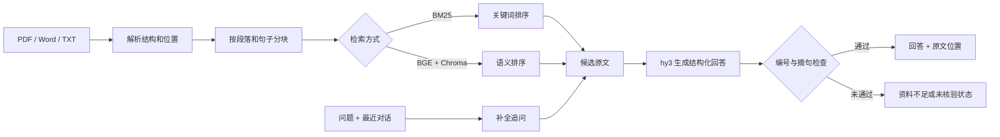

# 知页 · AI 知识库助手

上传 PDF、Word 或 TXT 后，可以围绕文档连续提问，并回到原文核对答案。页面提供一份虚构员工手册，不准备文件也能体验完整流程。

我在这个项目中主要解决三个问题：怎样保留 PDF 页码和 Word 段落位置，怎样兼顾关键词与同义表达检索，以及怎样避免模型把不存在的原文写成引用。资料不够、检索无结果和模型输出异常会显示为不同状态，方便判断下一步该补文档、换问法还是重试。

## 目前完成

- 支持 PDF、Word、TXT，保留文件名、PDF 物理页码、Word 段落或表格行位置。
- 提供 BM25 关键词检索和本地 BGE-small-zh-v1.5 语义检索，可在当前文档中切换并复用索引。
- 支持最近三轮有效问答的追问补全；页面显示改写后的完整问题，历史回答不作为新答案的证据。
- 模型返回结构化答案、来源编号和连续原文摘句，程序核对后再展示为已回答。
- 会话内保留问答和状态，支持 Markdown 导出；切换文档与清空记录需要显式确认。
- 57 项自动测试通过。20 道虚构政策开发题最终通过预设状态与事实字符串检查；该数据集参与过调试，因此只用于回归检查。

## 工作流程



## 几个关键取舍

### 分块先尊重文档结构

分块上限为 400 字符。程序优先保留完整段落，长段落再按句子拆分，相邻块最多重叠 60 字符。这样比固定字符切割更容易保留一条制度的条件和结论，但复杂表格、多栏 PDF 和跨段规则仍可能被拆开。

### 两种检索各有用途

BM25 对条款名、数字和原文词语更直接，也不需要下载模型。语义检索使用本地 BGE-small-zh-v1.5 和 Chroma，更适合同义改写。向量只负责候选片段排序；项目没有用未经校准的相似度阈值直接判断能否回答。

向量计算在运行应用的机器上完成，选中的原文片段和问题仍会发送给腾讯 MaaS 生成回答。首次使用语义检索需要下载模型到 `.model_cache/`。

### 引用由程序核对

模型需要返回 `answerable`、答案、来源编号和连续原文摘句。程序检查 JSON 格式、编号是否属于本轮候选来源，以及摘句是否真实存在于对应片段。检查失败时，拟生成的答案不会被当成已核验结果展示。

这项检查能发现编造编号或不存在的摘句，但不能保证模型对真实摘句的解释一定正确，也不能发现所有条件遗漏。

### 追问只补全问题

追问会先改写成可以独立检索的问题，再重新检索当前文档。例如“那试用期员工呢？”会补全为包含当前讨论主题的问题。历史答案只用于理解省略和指代，不会直接放进本轮证据。普通首轮通常调用一次回答服务；有历史的追问通常还需要一次改写调用。

### 状态要能解释失败位置

- `answered`：回答、来源编号和原文摘句均通过检查。
- `no_match`：关键词检索没有候选结果，跳过回答请求。
- `insufficient`：找到了候选内容，但不足以回答。
- `unverified`：模型格式、来源编号或原文摘句检查未通过。
- `error`：服务调用或追问改写失败。

模型返回空正文或因长度上限被截断时会标记为服务错误，不会误报为文档没有答案。

## 本地运行

```bash
python -m venv .venv
source .venv/bin/activate
python -m pip install -r requirements.txt
cp .env.example .env
python -m streamlit run app.py
```

在 `.env` 中填写腾讯 MaaS 的 API 密钥和地址。真实密钥不会提交到 Git。应用未配置服务时仍能打开示例并查看界面，但提问入口会保持禁用。

## 测试与开发评测

```bash
# 57 项自动测试，不调用付费 API
python -m unittest discover -v

# 默认只评估检索，不调用回答服务
python evaluation/run.py --mode keyword --output evaluation/keyword-retrieval.json

# 显式添加 --answers 才运行在线回答评测
python evaluation/run.py --mode semantic --answers --output evaluation/semantic-answers.json
```

开发集包含 14 道有答案题、4 道资料缺失题和 2 道资料冲突题。最终一次运行中，14 道题给出回答，6 道返回资料不足；单题耗时中位数约 1.8 秒。程序只检查预设状态和事实字符串，问题也参与过调试，所以 **20/20 不代表产品准确率**。完整迭代记录见 [evaluation/README.md](evaluation/README.md)。

另外有一组 6 题的小范围检索对照：关键词检索让正确段落在 2/6 的问题中排第一、2/6 进入前三；语义检索为 4/6 排第一、6/6 进入前三。短文档和小样本只能帮助定位检索差异，不能代表长文档效果。

GitHub Actions 会在推送和 Pull Request 时安装依赖、运行全部测试并检查 Python 语法，不配置 API 密钥，也不调用在线回答服务。

## 演示和求职材料

[项目演示脚本、简历描述、评测解释和 10 个面试追问](portfolio/项目一作品集材料.md)

推荐的现场演示顺序是：直接提问“正式员工每年有几天年假”，追问“那试用期员工呢”，最后询问文档没有写到的午餐政策。这样可以在几分钟内展示原文定位、多轮理解和资料不足处理。

## 当前边界

- 会话记录和文档索引保存在当前会话内存中，刷新、断开或服务重启后可能丢失；目前没有账号与跨设备同步。
- 扫描图片 PDF 没有 OCR；复杂 PDF 的多栏和表格阅读顺序可能不准确。
- Word 当前读取正文段落和顶层表格，不包含页眉、页脚、批注和文本框。
- 语义模型首次下载体积较大，仓库不提交 `.model_cache/`。
- 上生产前还需要独立长文档评测、权限隔离、持久化、限流、监控和数据保留策略。

## 代码结构

- `documents.py`：文件读取、原文位置和分块。
- `retrieval.py`：BM25 关键词检索。
- `vector_retrieval.py`：本地向量模型与 Chroma 索引。
- `rag_core.py`：追问补全、检索和回答流程。
- `grounding.py`：结构化输出与原文摘句检查。
- `conversation.py`：文档会话、结果保存和导出。
- `app.py`：Streamlit 界面与会话状态。
- `evaluation/`：20 道开发题、运行程序和历史结果。
